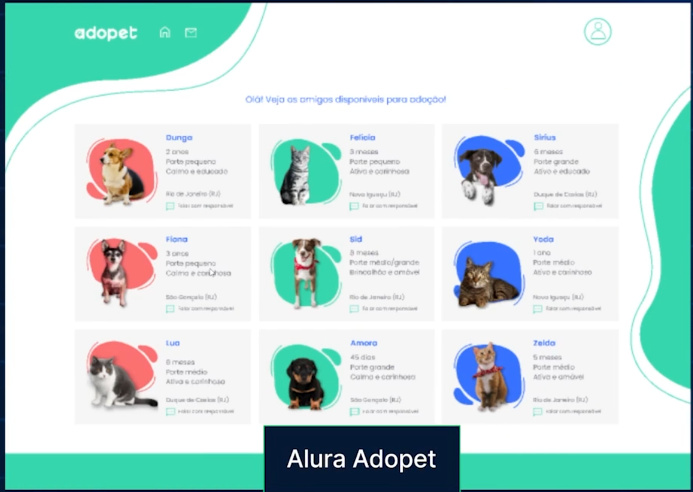

# Adopet

Um proijeto simples para adoção de animais que vai ser o projeto de exemplo durante os cursos da formação de boas práticas C3 da alura.

## Índice

* [Visão Geral](#visão-geral)
* [Funcionalidades](#funcionalidades)
* [Tecnologias Utilizadas](#tecnologias-utilizadas)
* [Layout](#layout)
* [Como Usar](#como-usar)

---

## Visão Geral

Este é um projeto de gerenciamento de adoção de animais.

## Funcionalidades

Abaixo as principais funcionalidades ou características do projeto.

* Importar uma lista de animais pela aplicação console;
* Visualziar uma lista de animais disponíveis para adoção;
* Cadastrar um animal;
* Editar um animal;
* Deletar um animal.
* 

## Tecnologias Utilizadas

Abaixo as principais tecnologias que está sendo utilizada para construir este projeto.

* **Linguagens**: [HTML, CSS] (Mesmo nao sendo linguagem e sim marcação de texto)
* **Ferramentas**: [Git, Figma]
* **Link do Repositório**: [https://github.com/denisiorodrigues/landing-page-clinica-medica.git](https://github.com/denisiorodrigues/landing-page-clinica-medica.git)

## Layout

### Desktop



## Como Usar

1.  **Clone o repositório:**
    ```bash
    git clone https://github.com/denisiorodrigues/Adopet.git
    ```
2.  **Navegue até a pasta do projeto**
    ```bash
    cd Adopet/
    ```
3. **Execute a aplicação console:**

    ```bash
    dotnet run --project ./Alura.Adopet.Console/
    ```
4. **Execute a aplicação webApi:**

    ```bash
    dotnet run --project ./Alura.Adopet.API/
    ```


Melhor artigo que fala de SOLID.
https://www.alura.com.br/artigos/solid